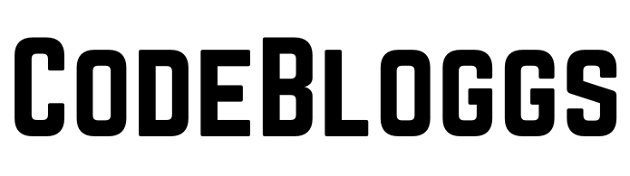
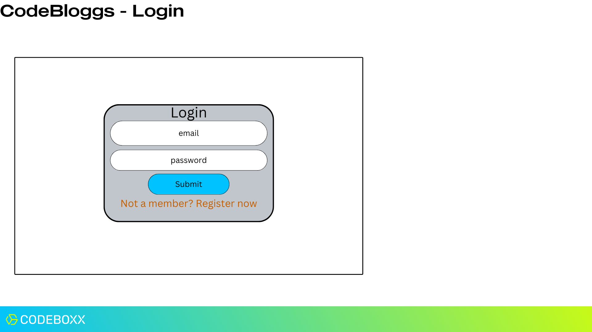
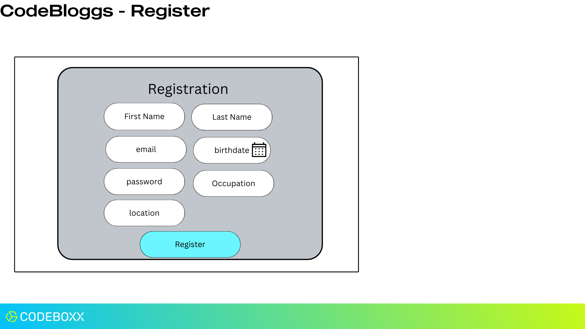
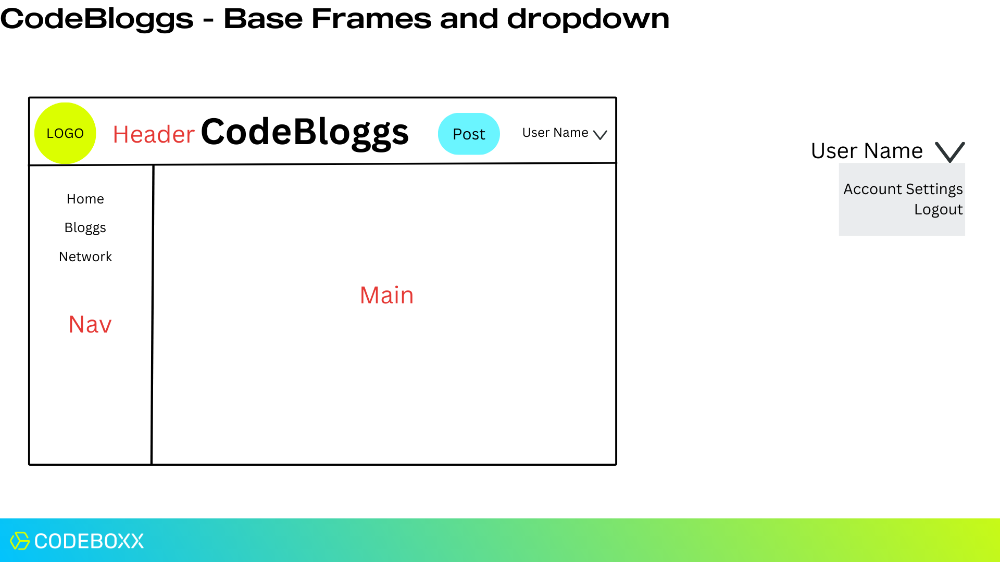
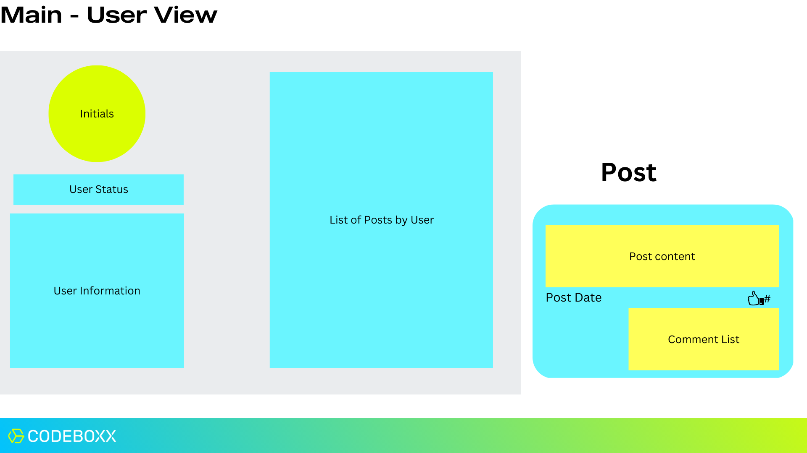
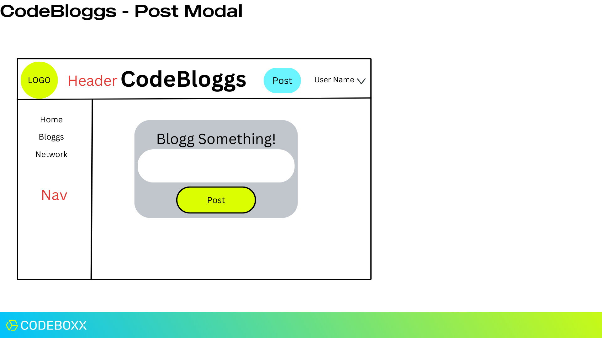
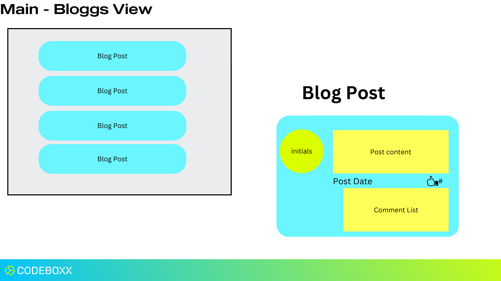
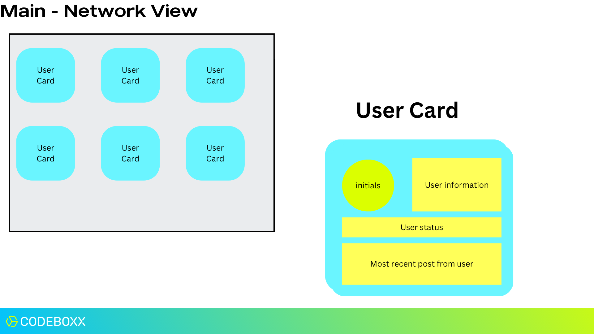
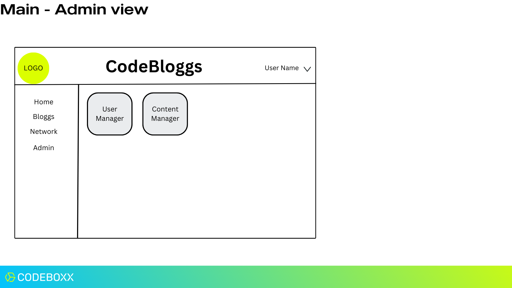
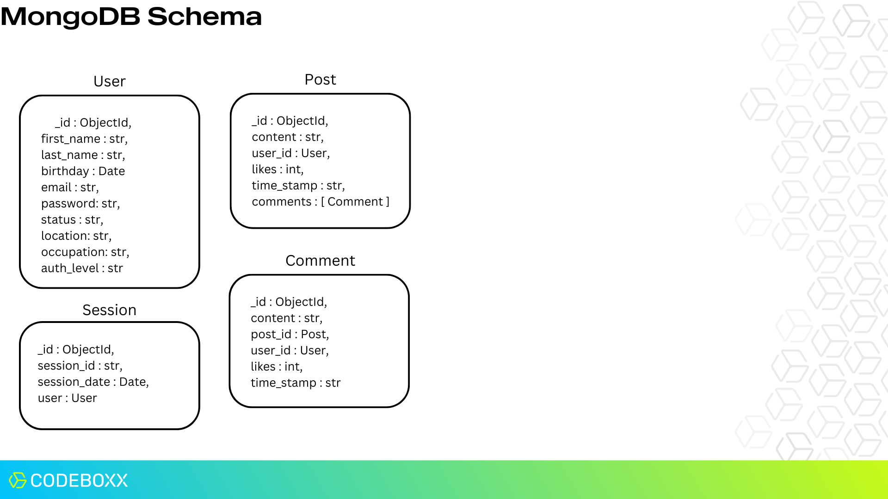

# Fullstack_Codebloggs
Collaboration and Design MOD 9 &amp; 10

### Matt and Ric

#### Setup and deployment:
The backend is in `./server` - main start file is `server.js`
- The `routes, controllers, middleware, and DB` all reside in the server directory
- .env in `./ ` is the configuration file for the server and the client
To start the server, navigate to `./server/`  and execute `'npm start'`

The frontend is in `./client` - main start file is `index.js`
- The public folder contains the index.html file and the images in `./public/img/`
- The src folder contains the React pages and code.
    -	App.js and index.js are in `./src/`
    -	The components are all in `./src/componnents/`
    - .env is in `./` and serves as the configuration file for the client frontend and the server backend
To start the frontend, navigate to `./client/` and execute `'npm start'`

.env:  see the submition file

# Research Answers / Documentation:
<!--  -->
<!-- </img> -->
</img>

## Wireframes:
<div style="clear: both;">
</img>

### Login Wire frame
1. What, if any DATA is required from the backend to render the wireframe?
No DATA is required from the backend to render the wireframe.

2. What, if any, ACTIONS is this wireframe responsible for? 
The wireframe takes input of email and password with basic validation.  When the Submit button is clicked, the email and password are sent to the Login API to initiate the login process.  Save information (not password) in the authContext useState variables.
API Call: POST(URL/user/login) req.body = { email, password }  [see API Description]
</div>
<br />
<br />
<div style="clear: both;">
</img>

### Register Wire frame
1. What, if any DATA is required from the backend to render the wireframe?
No DATA is required from the backend to render the wireframe.

2. What, if any, ACTIONS is this wireframe responsible for? 
This wireframe is used to register a new user.  It has 7 input fields for the user to provide information.  This information will be sent to the backend to create a new user.  
API Call: POST(URL/user/register) req.body = { first_name, last_name, birthday, email, password, status, occupation, location, auth_level }  [see API Description]
</div>
<br />
<br />
<div style="clear: both;">
</img>

### Base Frames and Dropdown wire frame
1. What, if any DATA is required from the backend to render the wireframe?
DATA needs to be retrieved to populate MAIN.  MAIN will be covered in the next several wireframes.  User name is retrieved from the authContext useState which was saved from the LOGIN.

2. What, if any, ACTIONS is this wireframe responsible for? 
The action is to initiate the population of the MAIN area of the page.  It needs to provide a means to logout and access settings.  It also provides a navigation pain for navigation to other main pages.
</div>
<br />
<br />
<div style="clear: both;">
</img>

### Main - User View Wire frame
1. What, if any DATA is required from the backend to render the wireframe?
A list of posts will be needed from the backend  to render the wireframe.  The list will be filtered down to the user, and the number of posts and the date of the last post will be calculated.
API call:  GET(URL/post/) {See API Description}

2. What, if any, ACTIONS is this wireframe responsible for? 
This wireframe will display user information in the left column, and the user’s posts in the right column.  The wireframe will get user information which is stored in the authContext, and it will calculate from the list of user’s posts the number of posts, and the date of the last post.  It will format the user information and the user’s posts on the display.  The user is not allowed to make any comments on their own posts or like their own posts. On this wire frame, the user may like comments from others.   
API Call: PUT(URL/comment/like/:id) where id is the comment id.  [see API Description]
</div>
<br />
<br />
<div style="clear: both;">
</img>

### Post Modal wire frame
1. What, if any DATA is required from the backend to render the wireframe?
No DATA is required from the backend to render the wireframe.

2. What, if any, ACTIONS is this wireframe responsible for? 
The action is to take the user input in the text box and create a new blogg post.
API Call: POST(URL/post/) req.body = { content , user_id }  [see API Description]
</div>
<br />
<br />
<div style="clear: both;">
</img>

### Main - Bloggs View wire frame
1. What, if any DATA is required from the backend to render the wireframe?
Get the X number of recent blogg posts and display them as a list.  Can be modified to omit the user’s own posts.
API Call: GET(URL/post/) [see API Description]

2. What, if any, ACTIONS is this wireframe responsible for? 
This wire frame will allow the user to read the post and comments.  Also, they can like and comment on the post or comments which are not their own. 
API Call: PUT(URL/comment/like/:id) where id is the comment id.  [see API Description]
API Call: PUT(URL/post/like/:id) where id is the post id.  [see API Description]
</div>
<br />
<br />
<div style="clear: both;">
</img>

### MAIN-Network Wire frame
1. What, if any DATA is required from the backend to render the wireframe?
Get the X number of users and display them as a list. 
API Call: GET(URL/user/) [see API Description]

2. What, if any, ACTIONS is this wireframe responsible for? 
Clicking a user will show all user info in a separate area.  
</div>
<br />
<br />
<div style="clear: both;">
</img>

### Main-Admin View Wire frame
1. What, if any DATA is required from the backend to render the wireframe?
This wireframe will be available to those users with auth_level of “Admin”.  Currently it is not developed.  Two cards are available that will be developed in the future.  

2. What, if any, ACTIONS is this wireframe responsible for? 
When developed, the cards will take the admin to the appropriate management pages.
<br />
<br />
</div>

# API DESCRIPTIONS

## MongoDB Schema Wire frame
<div style="clear: both;">
</img>

These four schemas define the MongoDB utilized by this site.  They are managed by the backend via several APIs.
<br />
<br />
</div>

## User APIs
### usersList
#### POST /user/login
Login API which will check that the provided user is in the User collection, and that the provided password matches the encrypted password in the document.

**Parameters**
|  **TYPE**  |  **NAME**  |  **Description**  |
|--------|--------|---------------|
| Path | path_param | Brief description |
| Query | query_param | Brief description |
| Body | { email, password } | Take email and password as body parameters. Return valid true/false, and user _id and auth_level. |

**Sample Response**
```json
{
    "status": "ok",
    "data": {
        "valid": true,
        "user": {
            "_id": "65b2734fd030c1e2fcfd6f00",
            "auth_level": "Basic"
        }
    },
    "message": "Login successful"
}
```
### Register API
#### POST /user/register
This API creates a new user with the required information.  It will make the auth_level value “Basic”.

**Parameters**
|  **TYPE**  |  **NAME**  |  **Description**  |
|--------|--------|---------------|
| Path | path_param | Brief description |
| Query | query_param | Brief description |
| Body | { first_name, last_name, birthday, email, password, status, location, occupation, auth_level } | Take all required fields as body parameters and create an account.
Birthday in Date format (YYYY-MM-DD[THH:MM:SS])-THH:MM:SS is optional. |

**Sample Response**
```json
{
    "status": "ok",
    "data": {
        "valid": true
    },
    "message": "User created"
}
```
### Logout API
#### POST /user/logout
This API Takes no parameters.  The API checks for a session that matches the session_id cookie.  If a match is found, the session is removed, and the cookie is cleared.
**Parameters**
|  **TYPE**  |  **NAME**  |  **Description**  |
|--------|--------|---------------|
| Path | path_param | Brief description |
| Query | query_param | Brief description |
| Body | body_param | Brief description |

**Sample Response**
```json
{
  "status": "ok",
  "message": "You are logged out"
}
```
### usersList API
#### GET /user/
No parameters required for this API.  It will return a list of users sorted alphabetically by last_name.
**Parameters**
|  **TYPE**  |  **NAME**  |  **Description**  |
|--------|--------|---------------|
| Path | path_param | Brief description |
| Query | query_param | Brief description |
| Body | body_param | Brief description |

**Sample Response**
```json
{
    "status": "ok",
    "data": {
        "valid": true,
        "user_list": [
            {
                "user_id": "65b2734fd030c1e2fcfd6f00",
                "first_name": "Jim",
                "last_name": "Doe",
                "birthday": "2024-01-25T09:00:00.000Z",
                "email": "jimdoe@email.com",
                "status": "I am in school",
                "location": "Tampa",
                "occupation": "Software Developer",
                "auth_level": "Basic"
            },
            {
                "user_id": "65b273edd030c1e2fcfd6f02",
                "first_name": "John",
                "last_name": "Smith",
                "birthday": "1999-12-31T00:00:00.000Z",
                "email": "johnsmith@email.com",
                "status": "I am working",
                "location": "St. Petersburg",
                "occupation": "Software Developer",
                "auth_level": "Admin"
            },
            {
                "user_id": "65b27587d030c1e2fcfd6f05",
                "first_name": "Timmy",
                "last_name": "Timmy",
                "birthday": "2005-07-04T16:00:00.000Z",
                "email": "timmy@email.com",
                "status": "Timmy",
                "location": "Madeira Beach",
                "occupation": "Software Engineer",
                "auth_level": "Admin"
            }
        ]
    },
    "message": "Users sent"
}
```
### getUser API
#### GET /user/:user_id
This API takes a user_id as a path parameter, and it returns the information for that user not including the password.
**Parameters**
|  **TYPE**  |  **NAME**  |  **Description**  |
|--------|--------|---------------|
| Path | user_id | Takes user_id to identify the user info to return |
| Query | query_param | Brief description |
| Body | body_param | Brief description |

**Sample Response**
```json
{
    "status": "ok",
    "data": {
        "valid": true,
        "user": {
            "user_id": "65b273edd030c1e2fcfd6f02",
            "first_name": "John",
            "last_name": "Smith",
            "birthday": "1999-12-31T00:00:00.000Z",
            "email": "johnsmith@email.com",
            "status": "I am working",
            "location": "St. Petersburg",
            "occupation": "Software Developer",
            "auth_level": "Admin"
        }
    },
    "message": "User sent"
}
```
## Session APIs
### createSession API
#### POST /session/
The API will take the user_id and create a uuid v4 token to be used as a session_id.  A session will be created using the session_id, a session_date set as now, and the user_id.  It will then post a new cookie named session_id with a maxAge of 24 hours.
**Parameters**
|  **TYPE**  |  **NAME**  |  **Description**  |
|--------|--------|---------------|
| Path | user_id | Takes user_id to create the user’s session. Returns the Session information. |
| Query | query_param | Brief description |
| Body | body_param | Brief description |

**Sample Response**
```json
{
  "status": "ok",
  "data": {
	    "valid": true,
	    "newSession": {
            "session_id": "1d64c842-e345-4424-92ea-725a3f44c2c5",
            "session_date": "2024-01-25T18:43:37.532Z",
            "user": "65b273edd030c1e2fcfd6f02",
            "_id": "65b2abd96eccb591c2e8bca3",
            "createdAt": "2024-01-25T18:43:37.544Z",
            "updatedAt": "2024-01-25T18:43:37.544Z",
            "__v": 0
        },
    },
    "message": "Session saved successfully"
}
```
### validateToken API
#### POST /validate_token/
No parameters are required for this API.  It uses the Session_id cookie and checks that the cookie matches a session document in the sessions collection.  If found, it responds with calid: true and the user.id: set to user._id.
**Parameters**
|  **TYPE**  |  **NAME**  |  **Description**  |
|--------|--------|---------------|
| Path | path_param | Brief description |
| Query | query_param | Brief description |
| Body | body_param | Brief description |

***Sample Response***
```json
{
    "status": "ok",
    "data": {
        "valid": true,
        "user": {
            "id": "65b273edd030c1e2fcfd6f02"
        }
    },
    "message": "Valid session"
}
```
## Post APIs
### getAllPosts API
#### GET /post/
No parameters are required.  Returns a list of all posts sorted from the newest to the oldest.
**Parameters**
|  **TYPE**  |  **NAME**  |  **Description**  |
|--------|--------|---------------|
| Path | path_param | Brief description |
| Query | query_param | Brief description |
| Body | body_param | Brief description |

**Sample Response**
```json
{
    "status": "ok",
    "data": {
        "valid": true,
        "posts": [
            {
                "_id": "65b3ec6d64ea0b5efdc63c69",
                "content": "Tim Tim Timmy",
                "user_id": {
                    "_id": "65b27587d030c1e2fcfd6f05",
                    "first_name": "Timmy",
                    "last_name": "Timmy",
                    "birthday": "2005-07-04T16:00:00.000Z",
                    "email": "timmy@email.com",
                    "status": "Timmy",
                    "location": "Madeira Beach",
                    "occupation": "Software Engineer",
                    "auth_level": "Admin"
                },
                "likes": 0,
                "time_stamp": "2024-01-26T17:31:25.178Z",
                "comments": []
            },
            {
                "_id": "65b3ebfb64ea0b5efdc63c65",
                "content": "Test3 content update",
                "user_id": {
                    "_id": "65b2734fd030c1e2fcfd6f00",
                    "first_name": "Jim",
                    "last_name": "Doe",
                    "birthday": "2024-01-25T09:00:00.000Z",
                    "email": "jimdoe@email.com",
                    "status": "I am in school",
                    "location": "Tampa",
                    "occupation": "Software Developer",
                    "auth_level": "Basic"
                },
                "likes": 0,
                "time_stamp": "2024-01-26T17:29:31.970Z",
                "comments": [
                    {
                        "_id": "65b4031aab772734dbbab374",
                        "content": "Tim Tim Timmy",
                        "post_id": "65b3ebfb64ea0b5efdc63c65",
                        "user_id": {
                            "_id": "65b27587d030c1e2fcfd6f05",
                            "first_name": "Timmy",
                            "last_name": "Timmy"
                        },
                        "likes": 0,
                        "time_stamp": "2024-01-26T19:08:10.526Z"
                    }
                ]
            },
                    ]
    },
    "message": "Posts fetched successfully"
}
```
### getPost
#### GET /post/:id
The getPost API takes a post id, and returns a response with the post contents.
**Parameters**
|  **TYPE**  |  **NAME**  |  **Description**  |
|--------|--------|---------------|
| Path | id | Provide the post id, returns the requested post |
| Query | query_param | Brief description |
| Body | body_param | Brief description |

**Sample Response**
```json
{
    "status": "ok",
    "data": {
        "valid": true,
        "post": {
            "_id": "65b3e3921cba8ff819673bdf",
            "content": "Test content",
            "user_id": {
                "_id": "65b2734fd030c1e2fcfd6f00",
                "first_name": "Jim",
                "last_name": "Doe",
                "birthday": "2024-01-25T09:00:00.000Z",
                "email": "jimdoe@email.com",
                "status": "I am in school",
                "location": "Tampa",
                "occupation": "Software Developer",
                "auth_level": "Basic"
            },
            "likes": 0,
            "time_stamp": "2024-01-26T16:53:38.323Z",
            "comments": [
                {
                    "_id": "65b4063317e9e5c35639a420",
                    "content": "This is a comment on the Test post.  It will be great to keep these going.",
                    "post_id": "65b3e3921cba8ff819673bdf",
                    "user_id": {
                        "_id": "65b273edd030c1e2fcfd6f02",
                        "first_name": "John",
                        "last_name": "Smith"
                    },
                    "likes": 0,
                    "time_stamp": "2024-01-26T19:21:23.688Z"
                },
                {
                    "_id": "65b407db6bb3a8bd2a457a9c",
                    "content": "The content is updated",
                    "post_id": "65b3e3921cba8ff819673bdf",
                    "user_id": {
                        "_id": "65b2734fd030c1e2fcfd6f00",
                        "first_name": "Jim",
                        "last_name": "Doe"
                    },
                    "likes": 0,
                    "time_stamp": "2024-01-26T17:29:31.970Z"
                }
            ]
        }
    },
    "message": "Post fetched successfully"
}
```
### createPost API
#### POST /post/
The createPost API takes the content and user_id. It then creates a new post with likes set to 0, the date set to now, and the comments set to an empty array.  It then returns the new post.
**Parameters**
|  **TYPE**  |  **NAME**  |  **Description**  |
|--------|--------|---------------|
| Path | path_param | Brief description |
| Query | query_param | Brief description |
| Body | content, user_id | Take content and user_id, and create a new post.  Return the new post. |

**Sample Response**
```json
{
    "status": "ok",
    "data": {
        "valid": true,
        "savedPost": {
            "content": "Tim Tim Timmy",
            "user_id": "65b27587d030c1e2fcfd6f05",
            "likes": 0,
            "time_stamp": "2024-01-26T17:31:25.178Z",
            "comments": [],
            "_id": "65b3ec6d64ea0b5efdc63c69",
            "createdAt": "2024-01-26T17:31:25.182Z",
            "updatedAt": "2024-01-26T17:31:25.182Z",
            "__v": 0
        }
    },
    "message": "Post saved successfully"
}
```
### updatePost API
#### PUT /post/:id
This API takes a post id as a path parameter, and a complete copy of the post with any changes. It then updates the post.  It responds with a copy of the updated post.
**Parameters**
|  **TYPE**  |  **NAME**  |  **Description**  |
|--------|--------|---------------|
| Path | id | Take the post id to be updated. |
| Query | query_param | Brief description |
| Body | content, user_id, likes, time_stamp, comments | Take content, user_id, likes, time_stamp, and comments.  Return the updated post. |

**Sample Response**
```json
{
    "status": "ok",
    "data": {
        "valid": true,
        "post": {
            "_id": "65b3ebfb64ea0b5efdc63c65",
            "content": "Test3 content update",
            "user_id": "65b2734fd030c1e2fcfd6f00",
            "likes": 0,
            "time_stamp": "2024-01-26T17:29:31.970Z",
            "comments": [],
            "createdAt": "2024-01-26T17:29:31.980Z",
            "updatedAt": "2024-01-26T18:37:59.431Z",
            "__v": 0
        }
    },
    "message": "Post updated successfully"
}
```
### likePost API
#### PUT /post/like/:id
The likePost API takes the post id as a path parameter, and it then increments the likes value by 1.  It responds with a copy of the updated post.
**Parameters**
|  **TYPE**  |  **NAME**  |  **Description**  |
|--------|--------|---------------|
| Path | id | Take a post id to identify the comment to like. |
| Query | query_param | Brief description |
| Body | body_param | Brief description |

**Sample Response**
```json
{
    "status": "ok",
    "data": {
        "valid": true,
        "post": {
            "_id": "65b3e3921cba8ff819673bdf",
            "content": "Test content",
            "user_id": "65b2734fd030c1e2fcfd6f00",
            "likes": 2,
            "time_stamp": "2024-01-26T16:53:38.323Z",
            "comments": [
                "65b4063317e9e5c35639a420",
                "65b407db6bb3a8bd2a457a9c",
                "65bd2fc959125916e90e0387",
                "65bd304359125916e90e0390",
                "65bd30c959125916e90e0399",
                "65bd30d759125916e90e03a2"
            ],
            "createdAt": "2024-01-26T16:53:38.344Z",
            "updatedAt": "2024-02-03T19:11:09.904Z",
            "__v": 0
        }
    },
    "message": "Post liked successfully"
}
```
## Comment APIs
### getAllComments API
#### GET /comment/
No parameters are required.  Returns a list of all comments.
**Parameters**
|  **TYPE**  |  **NAME**  |  **Description**  |
|--------|--------|---------------|
| Path | path_param | Brief description |
| Query | query_param | Brief description |
| Body | body_param | Brief description |

**Sample Response**
```json
{
    "status": "ok",
    "data": {
        "valid": true,
        "comments": [
            {
                "_id": "65b40d3872be3f9be7a1c1b5",
                "content": "This post is intended to be updated",
                "post_id": "65b3e4d76cd538e0a45272d4",
                "user_id": {
                    "_id": "65b2734fd030c1e2fcfd6f00",
                    "first_name": "Jim",
                    "last_name": "Doe"
                },
                "likes": 0,
                "time_stamp": "2024-01-26T19:51:20.679Z"
            },
            {
                "_id": "65b4063317e9e5c35639a420",
                "content": "This is a comment on the Test post.  It will be great to keep these going.",
                "post_id": "65b3e3921cba8ff819673bdf",
                "user_id": {
                    "_id": "65b273edd030c1e2fcfd6f02",
                    "first_name": "John",
                    "last_name": "Smith"
                },
                "likes": 0,
                "time_stamp": "2024-01-26T19:21:23.688Z"
            },
            {
                "_id": "65b4031aab772734dbbab374",
                "content": "Tim Tim Timmy",
                "post_id": "65b3ebfb64ea0b5efdc63c65",
                "user_id": {
                    "_id": "65b27587d030c1e2fcfd6f05",
                    "first_name": "Timmy",
                    "last_name": "Timmy"
                },
                "likes": 0,
                "time_stamp": "2024-01-26T19:08:10.526Z"
            },
            {
                "_id": "65b407db6bb3a8bd2a457a9c",
                "content": "The content is updated",
                "post_id": "65b3e3921cba8ff819673bdf",
                "user_id": {
                    "_id": "65b2734fd030c1e2fcfd6f00",
                    "first_name": "Jim",
                    "last_name": "Doe"
                },
                "likes": 0,
                "time_stamp": "2024-01-26T17:29:31.970Z"
            }
        ]
    },
    "message": "Comments fetched successfully"
}
```
### getComment API
#### GET /comment/:id
The getComment API takes a comment id and responds with the corresponding comment from the comment collection.
**Parameters**
|  **TYPE**  |  **NAME**  |  **Description**  |
|--------|--------|---------------|
| Path | id | Take a comment id and return the comment. |
| Query | query_param | Brief description |
| Body | body_param | Brief description |

**Sample Response**
```json
{
    "status": "ok",
    "data": {
        "valid": true,
        "comment": {
            "_id": "65b4031aab772734dbbab374",
            "content": "Tim Tim Timmy",
            "post_id": "65b3ebfb64ea0b5efdc63c65",
            "user_id": {
                "_id": "65b27587d030c1e2fcfd6f05",
                "first_name": "Timmy",
                "last_name": "Timmy"
            },
            "likes": 0,
            "time_stamp": "2024-01-26T19:08:10.526Z"
        }
    },
    "message": "Comment fetched successfully"
}
```
### createComment API
#### POST /comment/
This API creates a new comment.  It takes the content, the corresponding post_id, and the user_id.  It then creates the comment with 0 likes and a time_stamp of now.  It responds with a copy of the new comment.
**Parameters**
|  **TYPE**  |  **NAME**  |  **Description**  |
|--------|--------|---------------|
| Path | path_param | Brief description |
| Query | query_param | Brief description|
| Body | content, post_id, user_id | Take content, post_id, and user_id and create a new comment assigned to post_id by user_id.   Return new comment. |

**Sample Response**
```json
{
    "status": "ok",
    "data": {
        "valid": true,
        "savedComment": {
            "content": "This post is intended to be updated",
            "post_id": "65b3e4d76cd538e0a45272d4",
            "user_id": "65b2734fd030c1e2fcfd6f00",
            "likes": 0,
            "time_stamp": "2024-01-26T19:51:20.679Z",
            "_id": "65b40d3872be3f9be7a1c1b5",
            "createdAt": "2024-01-26T19:51:20.691Z",
            "updatedAt": "2024-01-26T19:51:20.691Z",
            "__v": 0
        }
    },
    "message": "Comment saved successfully"
}
```
### updateComment API
#### PUT /comment/:id
The updateComment API takes the comment id as a path parameter and a copy of all document fields with updates.  It then updates the comment, and returns a copy of the updated comment.
**Parameters**
|  **TYPE**  |  **NAME**  |  **Description**  |
|--------|--------|---------------|
| Path | id | Take a comment id to identify the comment to update. |
| Query | query_param | Brief description |
| Body | content, post_id, user_id, likes, time_stamp | Take content, post_id, user_id, likes, and time_stamp to update a  comment assigned to post_id by user_id.   Return updated comment. |

**Sample Response**
```json
{
    "status": "ok",
    "data": {
        "valid": true,
        "comment": {
            "_id": "65b407db6bb3a8bd2a457a9c",
            "content": "The content is updated",
            "post_id": "65b3e3921cba8ff819673bdf",
            "user_id": "65b2734fd030c1e2fcfd6f00",
            "likes": 0,
            "time_stamp": "2024-01-26T17:29:31.970Z",
            "createdAt": "2024-01-26T19:28:27.637Z",
            "updatedAt": "2024-01-26T19:36:01.460Z",
            "__v": 0
        }
    },
    "message": "Comment updated successfully"
}
```
### likeComment API
#### PUT /comment/like/:id
The likeComment API takes the comment id of the comment to be liked.  It then increments the like field by 1.  Finally it responds with a copy of the updated comment.
**Parameters**
|  **TYPE**  |  **NAME**  |  **Description**  |
|--------|--------|---------------|
| Path |  id | Take a comment id to identify the comment to like. |
| Query | query_param | Brief description |
| Body | body_param | Brief description |

**Sample Response**
```json
{
    "status": "ok",
    "data": {
        "valid": true,
        "comment": {
            "_id": "65bc735b24f0b82cb13fc61d",
            "content": "test 2",
            "post_id": "65bc38d5212f0f5463cad20c",
            "user_id": "65b273edd030c1e2fcfd6f02",
            "likes": 3,
            "time_stamp": "2024-02-02T04:45:15.033Z",
            "createdAt": "2024-02-02T04:45:15.034Z",
            "updatedAt": "2024-02-03T19:25:35.766Z",
            "__v": 0
        }
    },
    "message": "Comment liked successfully"
}
```
**Matt Research Document**

    --Reactive design--
 Reactive design allows a website to seamlessly adjust its layout, content, and functionality based on user interactions, screen sizes, and device capabilities. It's all about providing users with a dynamic and engaging experience, where the website responds intelligently to their actions, ensuring smooth navigation and optimal usability regardless of the device they're using.

    --Responsive Design--
Responsive design makes the webiste capable of gracefully contorting and adjusting itself to fit any screen size or device type. Whether you're browsing on a large desktop monitor or a tiny smartphone screen, responsive design ensures that the website's layout, images, and text resize and rearrange themselves fluidly to provide the best possible viewing experience. The website should adapt seamlessly to your device making navigation effortless and it's content easily accessible.


Reactive design and responsive design, while both aiming to enhance user experience across various devices, operate in distinct ways. 
Responsive design primarily focuses on adapting the layout and content of a website to different screen sizes, ensuring readability and accessibility across devices like desktops, tablets, and smartphones. It employs fluid grids, flexible images, and media queries to achieve this adaptability, allowing the website to seamlessly resize and restructure its elements.
On the other hand, reactive design goes beyond mere adaptation by introducing dynamic interactivity and real-time responsiveness to user actions and environmental changes. Unlike responsive design, which mainly adjusts based on screen dimensions, reactive design leverages technologies like JavaScript and reactive frameworks to create highly interactive and engaging user experiences. It responds not only to screen size variations but also to user inputs, device capabilities, and other contextual factors, offering a more personalized and intuitive interaction model.
While responsive design ensures consistent display and usability across devices, reactive design elevates the user experience by adding layers of interactivity and responsiveness, making the website feel more alive and dynamic. Each approach has its merits depending on the goals and requirements of the project, with responsive design focusing on universal accessibility and reactive design emphasizing user engagement and interaction.